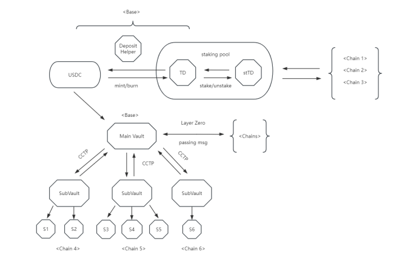

# 特点

* TD为用户入场代币，始终与USDC保持1：1的软挂钩比例铸造（销毁的时候有0.04%的手续费）。
* stTD为质押代币，通过质押TD获得。其性质为混合代币，通过delta中性策略自动产生收益。它代表了对底层TD及累计收益的索偿权。通过unstake用当时的stTD/TD比例获得新的TD数量，获得TD的增长。
* &#x20;DeFi货币市场基金，这是一个DeFi领域的货币市场基金，它提供了一个既保守又具有流动性的投资组合。该基金每日分配利润，为投资者提供了一种稳定且持续的收益来源。
* &#x20;使用简便：只需铸造(TD)并直接质押(获得stTD)一次，之后无需操心，您的资金将自动增长。

<figure><figcaption></figcaption></figure>
