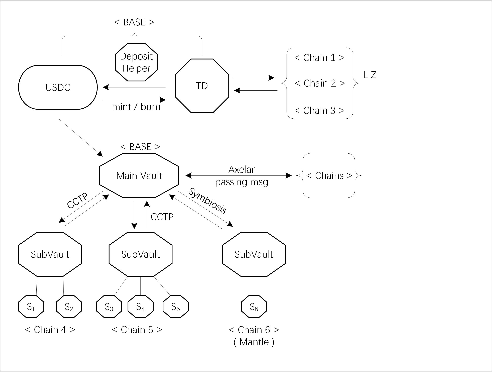

# 特点

* 收益生成的稳定币，完全由能够产生收益的DeFi资产作为抵押，TD（Tizi 代币）与USDC保持1:1的挂钩比例。
* &#x20;DeFi货币市场基金，这是一个DeFi领域的货币市场基金，它提供了一个既保守又具有流动性的投资组合。该基金每日分配利润，为投资者提供了一种稳定且持续的收益来源。
* &#x20;使用简便：只需铸造一次，之后无需操心，您的资金将自动增长。

<figure><figcaption>
Legend: hexagon—contracts, {} – set of chains, Arrow—How the money flows, &#x3C;> -- chain
</figcaption></figure>
